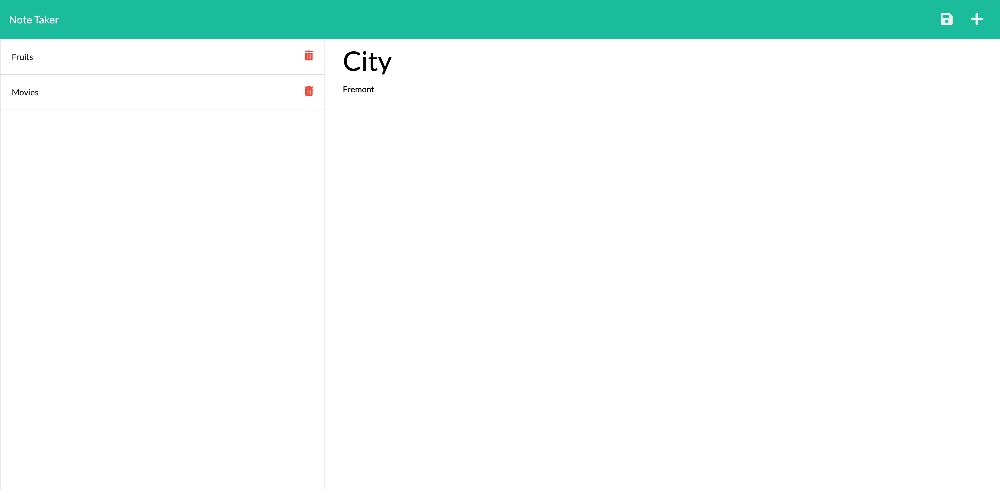

# Assignment 11: Note Taker

## Task Description

Assignment 11 was to create an application called Note Taker that can be used to write and save notes using Express.js.

1. When clicked on Get Started, the application navigates to a Note taker page
2. On left hand side, already added notes are displayed
3. Once you add a Title and the test, save button will be displayed
4. When clicked on the save button, the note will be added to the left section and to the database
5. When clicked on the delete button, the note will be deleted from the left section, also from the database.
6. To go back to the "Get Started" page just click on the title "Note Taker".

## Link to the github

https://github.com/rimadas9878/Notes-Taker

## Link of Heroku

https://hidden-tor-52583.herokuapp.com/

## Image of the application

The following images show the web application's appearance:

